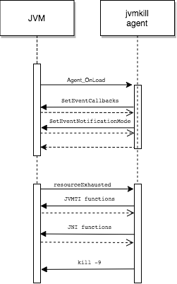

# Developers' Guide

jvmkill is a [JVMTI][] agent written in C++ and built using header files provided by the JDK.

[JVMTI]: http://docs.oracle.com/javase/8/docs/technotes/guides/jvmti/

## Dependencies

jvmkill has the following dependencies:
* make for building
* g++ for C++ compilation and linking
* JDK for JVMTI and JNI header files

Development was undertaken on macOS 10.12 using GNU Make 3.8.1, g++ 4.2.1 (both installed as part of Xcode), and Apple JDK 1.8.0_66.

The [jvmkill ci pipeline][] builds the agent for various platforms (at the time of writing: macOS and Ubuntu Trusty). The pipeline definition is stored in the [Java Experience Concourse git repo][] (a private repository).

[jvmkill ci pipeline]: https://java-experience.ci.springapps.io/teams/java-experience/pipelines/jvmkill
[Java Experience Concourse git repo]: https://github.com/pivotal-cf/java-experience-concourse

## Code Structure

The code is rooted in the `Agent_OnLoad` function in [jvmkill.c++][]. This function is called when the JVM loads the agent.

The agent registers a `resourceExhausted` function with the JVM which is called whenever the JVM encounters a resource exhausted event.

The `resourceExhausted` function obtains a monitor lock, calls the `AgentController` class which delegates to various `Action` classes to act on the resource exhaustion, and then releases the monitor lock before returning. One of the actions which may be driven is to kill the JVM, in which case the JVM process is killed, including the current thread, and there will be no return to the `AgentController` class.

The following sequence diagram shows some typical interactions between the JVM and the jvmkill agent:

[jvmkill.c++]: ../jvmkill.c++

## Testing

jvmkill has unit and other tests. See the [Building][] section of the README for how to run the tests.
                                  
[Building]: ../README.md#Building

## Contributing

Please refer to the [Contributors' Guide][].

[Contributors' Guide]: CONTRIBUTING.md

## Community

Others involved in jvmkill development use the `#java-buildpack` channel of the  [Cloud Foundry slack organisation][] for discussion.

[Cloud Foundry slack organisation]: https://cloudfoundry.slack.com